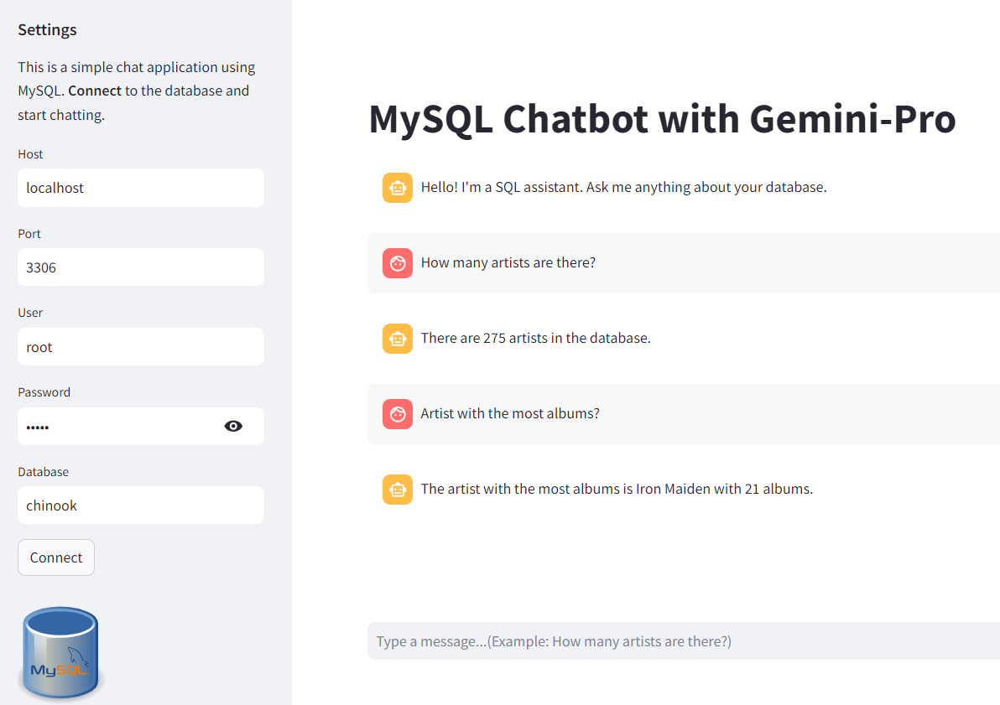
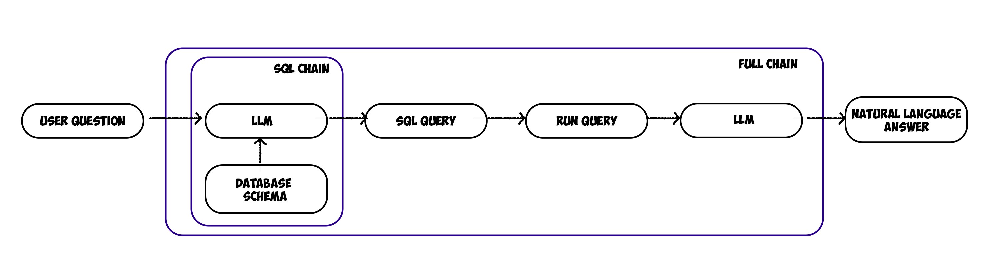

# MySQL Chatbot with Gemini-Pro

This project develops a chatbot that interprets natural language queries, generates SQL queries, and fetches results from a SQL database in an intuitive, user-friendly way. It leverages the Gemini-Pro model and integrates with the Streamlit GUI for an enhanced interactive experience.

## Final Chatbot


## Database
The [Chinook](https://githuz`b.com/lerocha/chinook-database) data model represents a digital media store, including tables for artists, albums, media tracks, invoices and customers.    


## Features
- **Natural Language Processing**: Employs Gemini-Pro to accurately interpret and respond to user queries in natural language.
- **SQL Query Generation**: Automatically creates SQL queries from the user's natural language input.
- **Database Interaction**: Connects to a SQL database to fetch results, showcasing real-world database interactions.
- **Railway storage database**: Upload Chinook.sql to database railway for deployment.
- **Streamlit GUI**: Provides an intuitive interface built with Streamlit, accessible to users of all skill levels.
- **Python-based**: Fully developed in Python, highlighting best practices in modern software development.
## How the Chatbot Works?

The chatbot takes a user's natural language query and converts it into a SQL query using Gemini-Pro. It then executes the query on a SQL database and presents the results back to the user in natural language. This process involves multiple steps of data processing and interaction with the GOOGLE API and a SQL database, all seamlessly integrated into a Streamlit application.

Refer to the following diagram to understand how the different chains and components are constructed:




#### Some questions for the chatbot:
- How many artists are there?
- Artist with the most albums?
- List employees and their supervisors?
---

#### Project Organization
```
.
├── README.md                         : report
├── docs/                             : contains images
├── app.py                            : chatbot
├── .gitignore                        : hide item
└── requirements.txt                  : requirements to run chatbot  
```
#### Local and Railway storage databases:
|   |Local   | Railway  |  
|---|---|---|
| user  |  root |   root|  
| password | admin  | (secret)  | 
| host  | localhost  | viaduct.proxy.rlwy.net  |  
| port  | 3306  | 20282  |  
| database  | chinook  |  railway (chinook) |  

*[Chatbot](https://chatbot-mysql-gemini.streamlit.app/) has been deployed from Railway database*

---

#### Tools Used:
- MySQL
- LangChain
- Streamlit
- Railway
---